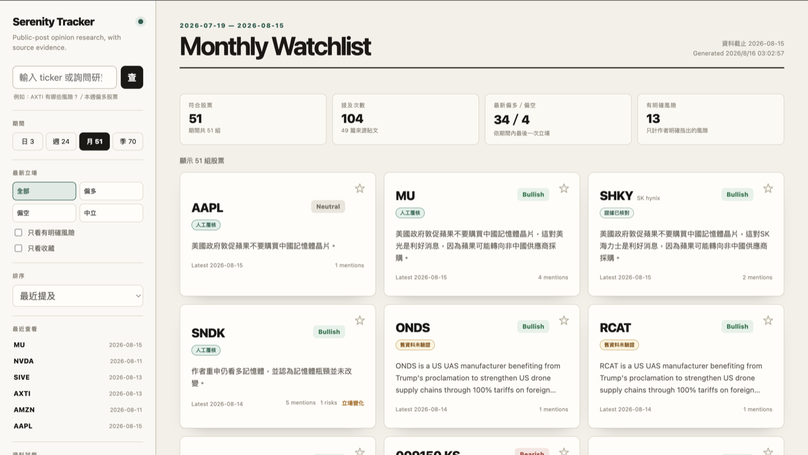
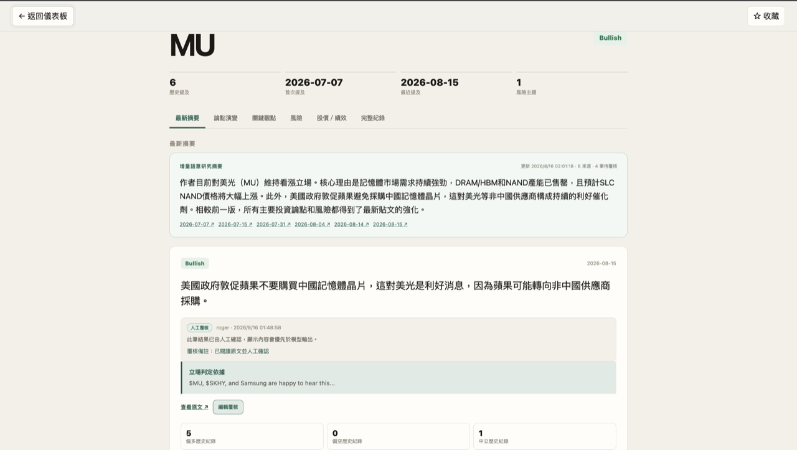
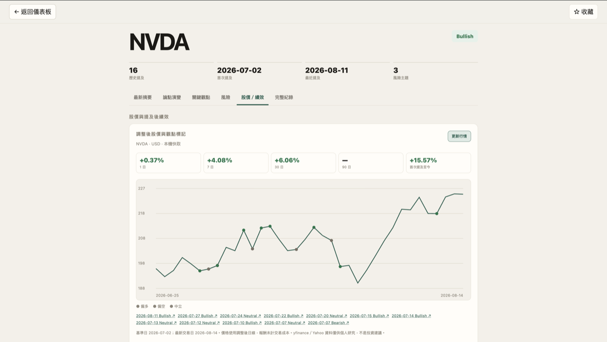
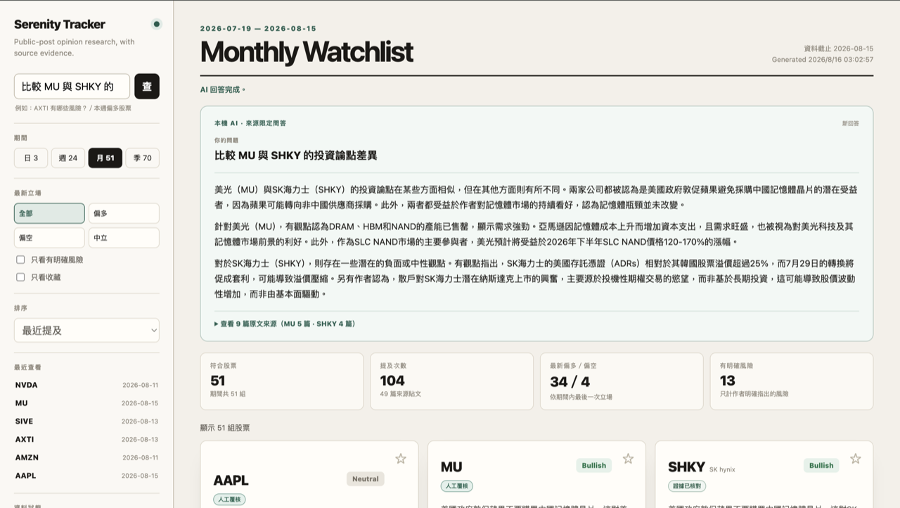
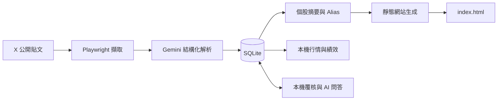

# Serenity Tracker

> 把指定 X 帳號的股票觀點，整理成可搜尋、有時間軸、有原文證據的研究儀表板。

Serenity Tracker 會定期擷取公開貼文中的 `$TICKER`，使用 Gemini 整理作者的多空立場、核心論點與風險，再用 SQLite 保存歷史並生成靜態網站。它不是選股或交易訊號工具，而是幫助你快速回顧「作者曾經怎麼看、觀點是否改變、依據來自哪篇原文」。



## 可以做什麼

- 用日、週、月、季視圖查看最近被提及的股票與最新立場。
- 搜尋 ticker，或直接輸入「AXTI 有哪些風險？」等規則式問題。
- 在個股頁查看最新摘要、論點演變、關鍵觀點、風險與完整歷史。
- 將同一公司的不同 ticker alias 合併顯示，避免重複卡片。
- 收藏股票、保留最近查看紀錄，並把篩選條件同步到網址。
- 在本機人工覆核模型結果，不需要手動輸入 `post_id`。
- 在本機查看提及後股價表現，或用 Gemini 比較多檔股票的研究論點。

## 公開網站和本機版的差別

| 功能 | 公開靜態網站 | 本機研究站 |
| --- | :---: | :---: |
| 日／週／月／季儀表板 | ✓ | ✓ |
| 搜尋、情緒、風險、收藏 | ✓ | ✓ |
| 個股摘要、時間軸與原文 | ✓ | ✓ |
| 規則式自然語言查詢 | ✓ | ✓ |
| 人工覆核與修正 | — | ✓ |
| 股價圖與提及後績效 | — | ✓ |
| 有來源的 AI 問答 | — | ✓ |

公開版是單一 `index.html`，不包含資料庫、API 金鑰或可寫入後端。本機版由 `./review_site.sh` 啟動，只監聽 `127.0.0.1`。

## 功能畫面

### 個股研究摘要與人工覆核



### 股價、提及標記與績效



### 有原文來源的本機 AI 問答



## 快速開始

### 需求

- macOS、Linux 或 Windows WSL
- Python 3.10 以上
- 可登入 X 的 `auth_token`
- Gemini API key

### 1. 安裝

```bash
git clone https://github.com/RogerH0711/Serenity_Tracker.git
cd Serenity_Tracker

python3 -m venv venv
source venv/bin/activate
pip install -r requirements.txt
playwright install chromium
```

### 2. 設定憑證

在專案根目錄建立 `.env`：

```env
GEMINI_API_KEY=your_gemini_api_key
X_AUTH_TOKEN=your_x_auth_token
```

`.env`、SQLite、爬蟲輸出與日誌都已被 `.gitignore` 排除。請勿把 X session token 貼到 issue、README 或終端截圖中。

### 3. 執行資料管線

```bash
./run_pipeline.sh
```

管線會依序初始化資料庫、抓取新貼文、解析新內容、更新個股摘要、掃描 alias、更新本機行情，最後重建 `index.html`。相同貼文重跑時不會重複分析或寫入。

### 4. 開啟完整本機版

```bash
./review_site.sh
```

瀏覽器開啟：

```text
http://127.0.0.1:8765
```

按 `Ctrl+C` 即可關閉服務。若只想查看靜態儀表板，也可以直接開啟 `index.html`。

## 使用範例

搜尋框同時支援 ticker、全文搜尋與常用問句：

```text
幫我看 SIVE
AXTI 有哪些風險？
目前有哪些偏多股票？
本週偏空股票
顯示我的收藏
比較 MU 與 SNDK 的投資論點差異
```

前五種查詢使用瀏覽器內的規則式解析，不消耗 Gemini 額度。需要跨股票整理與比較的問題，只有在本機版才會呼叫 Gemini，回答會附上可展開的原文來源。

篩選狀態也會寫入網址，方便重新整理或分享：

```text
index.html?period=week&sentiment=Bullish
index.html?ticker=AXTI&tab=risks
```

## 如何降低錯誤與重複資料

- X status ID 是貼文的唯一識別；SQLite 另以 `UNIQUE(post_id, ticker)` 防止重複。
- 只有新貼文與失敗項目會呼叫 Gemini，重跑管線不會重複消耗配額。
- Ticker 必須來自原文明示的 cashtag；常見金額字串不會被當成股票。
- 主貼文與引用脈絡分開保存，避免引用內容被誤當成作者自己的立場。
- 每個模型立場必須附上能在輸入文字中找到的逐字證據，否則拒絕寫入。
- 人工覆核保存在獨立 override 表，重新解析不會覆蓋人工決定。
- AI 問答只能引用已提供的來源；未知來源 ID、技術性 `post_id` 洩漏與未驗證公司狀態會被拒絕。

網站上的可信度標籤：

| 標籤 | 意義 |
| --- | --- |
| 人工覆核 | 已由使用者確認或修正 |
| 證據已核對 | 模型提供的立場證據可在來源文字找到 |
| 舊資料未驗證 | 舊版分析沒有逐字立場證據，只適合作為線索 |
| 待覆核 | 尚未取得足夠證據，建議閱讀原文 |

## 運作方式



主要技術：Python、Playwright、Google GenAI、Pydantic、SQLite、原生 HTML/CSS/JavaScript，以及本機選用的 yfinance 行情。

## 常用指令

```bash
# 完整增量管線
./run_pipeline.sh

# 本機研究站：人工覆核、行情、AI 問答
./review_site.sh

# 只更新指定股票行情
venv/bin/python prices.py --ticker NVDA

# 只更新指定股票的語意摘要
venv/bin/python summarize.py --ticker MU

# 執行不連線外部服務的測試
venv/bin/python -m unittest discover -s tests -v
```

<details>
<summary><strong>進階設定與環境變數</strong></summary>

```env
X_TARGET_ACCOUNT=aleabitoreddit
GEMINI_MODEL=gemini-2.5-flash
SCRAPE_SCROLL_ROUNDS=3
SCRAPE_MAX_POSTS=40
PARSER_MAX_POSTS=20
SUMMARY_MAX_TICKERS=2
PRICE_MAX_TICKERS=5
```

`run_pipeline.sh` 使用作業系統 advisory lock，避免 cron 同時啟動兩條管線。每個階段都會記錄成功數、失敗數與失敗類型；解析或摘要部分失敗時，既有成功資料不會先被刪除。

</details>

<details>
<summary><strong>人工覆核、重新解析與 Alias 管理</strong></summary>

一般情況請直接在 `./review_site.sh` 的個股頁按「人工覆核」。CLI 保留作為批次處理與除錯工具：

```bash
# 查看模型結果與來源
venv/bin/python review.py show POST_ID --ticker TICKER

# 重新解析仍存在於 raw_tweets.json 的貼文
venv/bin/python parser.py --reparse POST_ID

# 掃描與查看 alias 候選
venv/bin/python alias_review.py scan
venv/bin/python alias_review.py list

# 核准或拒絕候選
venv/bin/python alias_review.py approve 3 --company-name "Company Name" --exchange NASDAQ
venv/bin/python alias_review.py reject 4 --note "不同公司"
```

Alias 只有在人工核准後才會原子更新 `ticker_aliases.json`；原始資料庫中的 ticker 不會被改寫。

</details>

<details>
<summary><strong>Cron 與 GitHub Pages 發布</strong></summary>

每小時在本機更新：

```cron
0 * * * * /absolute/path/Serenity_Tracker/run_pipeline.sh >> /absolute/path/Serenity_Tracker/pipeline.log 2>&1
```

若已在 GitHub repository 的 Settings → Pages 啟用從 `main` 根目錄部署，可用安全發布腳本只提交生成後的 `index.html`：

```bash
./publish_site.sh
```

此腳本要求工作目錄乾淨、分支為 `main`、沒有未推送 commit，而且管線執行後只能有 `index.html` 發生變化；任何程式碼或設定異動都會停止發布。

</details>

## 專案結構

| 路徑 | 用途 |
| --- | --- |
| `scraper.py` | 擷取目標 X 帳號貼文與引用脈絡 |
| `parser.py` | 解析 ticker、立場、論點、風險與證據 |
| `storage.py` | SQLite schema、遷移與資料存取 |
| `summarize.py` | 增量產生個股摘要、論點演變與風險整理 |
| `prices.py` | 快取本機調整後行情並計算提及後績效 |
| `build_site.py` | 聚合資料並生成靜態 `index.html` |
| `review_site.py` | 提供本機人工覆核、行情與 AI 問答 API |
| `ticker_aliases.json` | 經人工確認的 ticker 合併與行情代碼設定 |
| `tests/` | 不連線外部服務的單元測試 |

## 已知限制

- X 頁面結構、登入流程或限流政策改變時，Playwright 擷取可能需要調整。
- 模型摘要仍可能錯誤；可信度標籤代表證據狀態，不代表結論一定正確。
- 本機行情來自 yfinance／Yahoo，只供個人研究，不會發布到 GitHub Pages。
- AI 問答只整理目前資料庫內容，不包含即時新聞、完整財報或外部事實查證。
- SQLite 與 `.env` 不進 Git；換電腦或雲端 Runner 時需要另外規劃資料持久化。

## 免責聲明

本專案只用於技術研究與資訊整理。模型產生的情緒、論點、風險與問答不保證完整或正確，也不構成投資建議。做出投資決策前，請閱讀原文並獨立查證。
